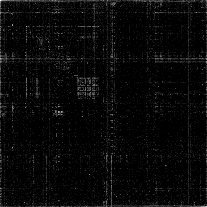

# CantorDust++

Implementazione autonoma in C++ ispirata al lavoro originale di [Christopher Domas](https://github.com/Battelle/cantordust).

Visualizza file binari come immagini per identificare pattern, sezioni e anomalie a colpo d'occhio.



---

## Visualizzazioni

| Tasto | Vista | Descrizione |
|-------|-------|-------------|
| `1` | Digraph | Coppie di byte consecutive su piano 2D |
| `2` | Dot Plot | Offset vs valore byte |
| `3` | Entropy | Entropia di Shannon per sezione |
| `4` | Histogram | Frequenza di ciascun valore byte (0–255) |
| `5` | 3D View | Triple di byte nello spazio 3D |
| `6` | RawPixels | Interpretazione dei byte come pixel, BPP con `[` e `]` |
| `7` | MetricMap | Curve Hilbert, Z-order e lineare (`V`); colori con `C` |
| `8` | ByteCloud | Frequenze dei byte in una griglia esadecimale |
| `9` | OneTuple | Distribuzione dei byte per gruppi consecutivi |

---

## Requisiti

### Linux / WSL2
```bash
# Ubuntu / Debian
sudo apt install build-essential g++ libglu1-mesa-dev libpng-dev libx11-dev python3 python3-pip python3-venv wget
```

### WSL2 su Windows 11
WSLg è necessario per il rendering grafico (incluso in Windows 11).

---

## Installazione rapida
```bash
git clone git@github.com:destshadow/cantordust_cpp.git
cd cantordust_cpp
./setup.sh
```

---

## Build manuale
```bash
# Scarica le librerie
cd libs
wget https://raw.githubusercontent.com/OneLoneCoder/olcPixelGameEngine/master/olcPixelGameEngine.h
wget https://raw.githubusercontent.com/nothings/stb/master/stb_image_write.h
wget https://raw.githubusercontent.com/nothings/stb/master/stb_image.h
cd ..

# Compila
make

# Avvia
./cantordust /path/to/binary
```

---

## Controlli

### Generale
| Tasto | Azione |
|-------|--------|
| `1-9` | Cambia vista |
| `O` | Apri file |
| `S` | Salva PNG |
| `←→` | Naviga nel file |
| `Home` | Reset (file intero) |

### Viste 2D (tutte tranne 5)
| Azione | Effetto |
|--------|---------|
| Rotella mouse | Zoom in/out |
| Drag sinistro | Pan (con zoom > 1x) |

### Vista 3D (5)
| Azione | Effetto |
|--------|---------|
| Drag sinistro | Ruota |
| Drag destro | Pan camera |
| `WASD` | Muovi camera |
| `Q/E` | Su/Giù |
| Rotella | Zoom |
| `R` | Reset |

---

## Struttura progetto
```
cantordust_cpp/
├── libs/                    # Single-header libraries
│   ├── olcPixelGameEngine.h
│   ├── stb_image_write.h
│   └── stb_image.h
├── src/
│   ├── main.cpp
│   ├── binary_reader.{h,cpp}      # Lettura file binario
│   ├── binary_format.{h,cpp}      # Parser ELF/PE
│   ├── digraph.{h,cpp}            # Visualizzazione digraph
│   ├── dotplot.{h,cpp}            # Dot plot
│   ├── entropy.{h,cpp}            # Entropia di Shannon
│   ├── histogram.{h,cpp}          # Istogramma byte
│   ├── trigraph.{h,cpp}           # Nuvola punti 3D
│   ├── renderer3d.{h,cpp}         # Renderer 3D software
│   ├── file_navigator.{h,cpp}     # Navigazione nel file
│   ├── screenshot.{h,cpp}         # Export PNG (stb)
│   ├── input_handler.{h,cpp}      # Gestione input
│   ├── ui_renderer.{h,cpp}        # Rendering UI
│   ├── constants.h                # Layout e costanti
│   ├── visualizer.{h,cpp}         # Orchestrazione principale
│   ├── visualizer_2d.cpp          # Canvas 2D + zoom
│   ├── visualizer_3d.cpp          # Input 3D
│   ├── visualizer_nav.cpp         # Navigazione + threading
│   └── visualizer_sections.cpp    # Overlay sezioni ELF/PE
├── python/                  # Neural network (WIP)
├── setup.sh                 # Setup automatico
├── Makefile
└── requirements.txt
```

---

## Classificatore N-gram e verifiche

La modalità Classifier della MetricMap usa campioni binari in
`templates/<classe>.bin`, relativi alla directory da cui si avvia il programma.
I nomi delle classi sono elencati in `src/classifier_model.h` (per esempio
`ascii.bin`, `x86.bin`, `x64.bin`). I campioni devono contenere almeno 4 byte.
Le classi prive di campioni non partecipano al confronto. Senza template validi
la modalità viene saltata con un messaggio; non vengono generate classificazioni
fittizie. I blocchi troppo corti per un N-gram sono mostrati in grigio.
Questa è una classificazione statistica, non una rete neurale.
Le cartelle Python e dataset sono predisposizioni attualmente senza codice.

Eseguire `make test` per i test di regressione senza interfaccia grafica.
I sorgenti sono in `tests/`, gli eseguibili generati in `build/`.

La selezione di una sezione mostra il suo intervallo esatto; cambiando colori,
BPP o vista l'intervallo viene mantenuto. Ogni ricalcolo elabora solo la vista
attiva e copia solo la finestra selezionata. Il file viene comunque caricato
interamente in memoria; il rendering 3D di file grandi può essere oneroso.
Il parser supporta ELF32/64 little-endian e PE; ELF big-endian viene rifiutato,
e le sezioni ELF senza byte nel file (`SHT_NOBITS`, come `.bss`) sono escluse.

---

## Dipendenze

### C++ (single-header, no install)
- [olcPixelGameEngine](https://github.com/OneLoneCoder/olcPixelGameEngine) — rendering
- [stb_image_write](https://github.com/nothings/stb) — export PNG

### Python (area sperimentale — WIP)

La cartella Python è una predisposizione e non fa parte delle funzionalità attuali.

---

## Crediti

- Christopher Domas — [CantorDust](https://github.com/Battelle/cantordust) (ispirazione)
- javidx9 / One Lone Coder — [olcPixelGameEngine](https://github.com/OneLoneCoder/olcPixelGameEngine)
- Sean Barrett — [stb libraries](https://github.com/nothings/stb)

---

## Licenza

MIT